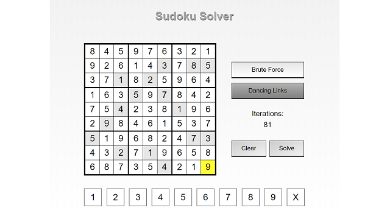

# Sudoku Solver

React application for solving a given [Sudoku](https://en.wikipedia.org/wiki/Sudoku).  

Utilizes two algorithms for solving:
* [Brute Force](https://en.wikipedia.org/wiki/Sudoku_solving_algorithms) backtracking algorithm.  
* [Dancing Links](https://arxiv.org/pdf/cs/0011047v1.pdf) algorithm by Donald Knuth, by reducing Sudoku to an [Exact Cover](https://en.wikipedia.org/wiki/Exact_cover#Sudoku) problem.

Check out the LIVE project [here](https://josephtkim.github.io/sudoku-solver/)

## Features  
* Use arrow keys to navigate the board.  
* Choose algorithm to solve a given Sudoku.  
* Displays the number of iterations to solve the Sudoku.  
  * For Brute Force, one iteration is counted as one placement of a candidate number.
  * For Dancing Links, one iteration is counted as one call to cover() or uncover().
* Keeps track of the initially provided clues.  